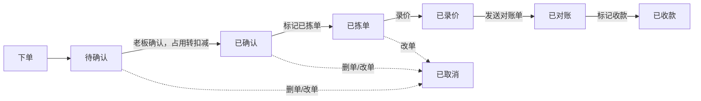

# 订单状态流转

## 业务状态（对外展示）

| 顺序 | 状态 | 说明 |
|------|------|------|
| 1 | **待确认** | 客户已下单，等老板确认 |
| 2 | **已确认** | 老板已确认，占用已转实物扣减，待拣单装货 |
| 3 | **已拣单** | 员工装货完成，准备派送 |
| 4 | **已录价** | 成交单价已录入 |
| 5 | **已对账** | 对账单已发送/打印 |
| 6 | **已收款** | 应收已结清 |
| — | **已取消** | 删单 / 改单作废 |

列表与详情上的 `statusLabel`、进度条均按上表六步 + 已取消展示。

---

## 主流程



### 各阶段触发条件

| 展示状态 | 判定条件 |
|----------|----------|
| 待确认 | 内部状态 `PENDING_CONFIRM` |
| 已确认 | 已确认未拣完（如 `PENDING_PICK` / `PICKING`） |
| 已拣单 | 拣单完成，尚未录价 |
| 已录价 | 已录入金额，尚未对账 |
| 已对账 | `printedAt` 已设置，尚未收齐 |
| 已收款 | 实收 ≥ 应收 |
| 已取消 | 内部状态 `CANCELLED` |

---

## 内部状态码（实现层）

数据库仍使用细粒度状态码，由 `OrderFlowStatus` 映射为上述业务状态：

| 内部码 | 常见对应展示 |
|--------|--------------|
| `PENDING_CONFIRM` | 待确认 |
| `PENDING_PICK` / `PICKING` | 已确认 |
| `PICKED` / `PENDING_PRICE` | 已拣单 |
| `PRICED` | 已录价 |
| （`printedAt` 有值） | 已对账 |
| （已收齐） | 已收款 |
| `CANCELLED` | 已取消 |

`DELIVERING` / `DELIVERED` / `COMPLETED` 等遗留码按拣单/录价/对账/收款进度归入上表。

---

## 详情页进度条（6 步）

与 `frontend/src/utils/order-flow.ts` 一致，固定六格：

**待确认 → 已确认 → 已拣单 → 已录价 → 已对账 → 已收款**

当前所在阶段高亮（橙色），已完成绿色，未到灰色；已取消订单首格显示「已取消」。

---

## 典型路径

```
客户下单 → 待确认
  → 老板点「确认」→ 已确认（占用转实物扣减）
  → 标记「已拣单」→ 已拣单（装货完成）
  → 录价 → 已录价
  → 发送对账单 → 已对账
  → 标记收款 → 已收款
```

---

## 关键文件

| 模块 | 路径 |
|------|------|
| 流转状态解析 | `backend/.../order/support/OrderFlowStatus.java` |
| 订单状态枚举 | `backend/.../common/enums/OrderStatus.java` |
| 订单服务 | `backend/.../order/service/OrderService.java` |
| 流程条工具 | `frontend/src/utils/order-flow.ts` |
| 流程条组件 | `frontend/src/components/OrderFlowBar.vue` |
