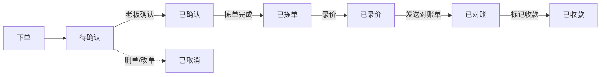

# 蔬菜批发商户微信小程序 PRD

| 项 | 值 |
|----|-----|
| 版本 | **v1.0** |
| 日期 | 2026-06-27 |
| 阶段 | 已实现功能规格（As-Built） |
| 关联 | [order_status.md](./order_status.md) · [customer-onboarding.md](./customer-onboarding.md) · [technical-architecture.md](./technical-architecture.md) · [README.md](./README.md) |

> v0.8（2026-06-12）为立项草案。本文档按当前代码回写，描述**已上线/可联调**能力与**已知缺口**。接口细节以 Knife4j（`/doc.html`）为准。

---

## 1. 背景与问题

蔬菜批发商户目前主要通过微信图片、文字、电话接收订单，再手写纸单交给工人分拣，送达后人工补录单价与汇总经营数据。

核心痛点：

- 接单信息分散，易漏记、错记。
- 纸单无法自动流转到分拣、录价、对账、统计。
- 分拣进度不透明，老板不知哪些单未处理。
- 价格波动大，录价滞后，应收不清晰。
- 出货与库存、采购缺乏统一视图。

## 2. 产品定位

**同一微信小程序，按登录身份进入三端：**

| 端 | 用户 | 定位 |
|----|------|------|
| 客户端 | 批发客户、散客 | 浏览商品、提交要货清单、查看订单 |
| 老板端 | 主管理员、档口老板、档口经理 | 订单工作台、商品/客户/库存、录价对账、采购、报表 |
| 工人端 | 配送员 | 查看待拣单、标记已拣单 |

首版目标：**替代纸单**，跑通「接单 → 确认 → 拣单 → 录价 → 对账 → 收款 → 统计」闭环；不追求完整 ERP。

## 3. 产品目标

### 3.1 业务目标

- 将微信/电话/图片订单转为结构化电子订单。
- 降低抄单、重复录入、人工汇总成本。
- 分拣、录价、收款、报表围绕同一订单流转。
- 沉淀客户、商品、价格、库存、出货与应收数据。

### 3.2 成功指标（方向性）

- 单笔订单录入耗时较手写显著下降。
- 订单状态可追踪，减少漏单。
- 当日销售/出货/应收可实时或一键查看。
- 录价后订单金额与客户欠款自动汇总。

## 4. 用户角色

### 4.1 角色定义

| 角色 | 代码 | 说明 |
|------|------|------|
| 主管理员 | `OWNER_ADMIN` | 档口最高权限；含数据平台 |
| 档口老板 | `STALL_OWNER` | 经营负责人；含数据平台 |
| 档口经理 | `STALL_MANAGER` | 日常运营；**不含**数据平台 |
| 配送员 | `WORKER` | 拣单/配送执行 |
| 客户 | `CUSTOMER` | 下单与查看自己订单 |

遗留：`PARTNER_ADMIN` 枚举仍兼容，业务等同档口经理。

### 4.2 角色能力矩阵

| 能力 | 主管理员 | 档口老板 | 档口经理 | 配送员 | 客户 |
|------|:--------:|:--------:|:--------:|:------:|:----:|
| 订单工作台（确认/拣单/录价/对账/收款） | ✓ | ✓ | ✓ | — | — |
| 商品/分类/库存管理 | ✓ | ✓ | ✓ | — | — |
| 客户/供应商/采购/报价 | ✓ | ✓ | ✓ | — | — |
| 销售/采购开单与记账 | ✓ | ✓ | ✓ | — | — |
| 数据平台（报表/排行/营收） | ✓ | ✓ | — | — | — |
| 人员管理与激活码 | ✓ | ✓ | ✓ | — | — |
| 档口下单码 / VIP 码 / 注册邀请 | ✓ | ✓ | ✓ | — | — |
| 待拣单与标记已拣 | — | — | — | ✓ | — |
| 浏览商品、下单、看自己的订单 | — | — | — | — | ✓ |
| 看单价/订单金额 | ✓ | ✓ | ✓ | — | 对账后* |
| 看客户电话/完整地址 | ✓ | ✓ | ✓ | — | 仅自己 |

\* 客户侧：订单**已录价且已对账**（或已完成态）后才展示单价与金额。

### 4.3 工人可见性限制

配送员仅可见：

- 被分配或待处理的拣单任务。
- 客户简称、简写地址（如「城南农贸 3 号门」）。
- 商品名称、下单数量、单位、备注。

不可见：客户电话、完整地址、单价、小计、订单总额、欠款、经营报表。

## 5. 客户入驻

详见 [customer-onboarding.md](./customer-onboarding.md)。

| 方式 | 老板入口 | 客户路径 | 适用场景 |
|------|----------|----------|----------|
| **档口下单码** | 我的 → 档口下单码 | 扫太阳码 → 登录 → 选购 | 路人/散客；长期有效 |
| **VIP 专属码** | 客户管理 → VIP专属码 | 我的 → 成为 VIP 客户 | 已建档合作客户绑定微信 |
| **注册邀请** | 客户管理 → 邀请注册 | 扫码填资料 → 待审核 | 新客户申请档案 |

规则摘要：

- VIP 码：8 位，绑定前长期有效，绑定后作废。
- 注册邀请：太阳码含 `r=` token，默认 7 天，可重新生成。
- 审核通过默认「下单后自动确认」**关闭**；拒绝后允许再次提交。
- 散客（未绑定档案）可下单，须填**店铺名称**；仅创建者可见历史订单。

## 6. 客户端功能规格

**底部导航**：下单 · 我的订单 · 我的

### 6.1 下单（`customer/home`）

- 按分类/子分类浏览；搜索商品。
- 多销售单位选品；数量加减加入清单。
- **自定义商品**：名称、数量、单位、备注（代采场景）。
- **批量录入**：粘贴文本 → 前端 `parseOrderText` 解析匹配商品（非后端 AI）。
- **语音录入**：调用系统键盘语音，非服务端 ASR。
- **拍照/相册/Excel 导入**：可提交图片单或解析后加购。
- 未绑定档案时显示「已有 VIP 专属码？去绑定」。
- **下单阶段不展示任何价格**。

### 6.2 购物车（`customer/cart`）

- 修改数量、单位、行备注；整单备注。
- 散客必填店铺名称。
- 提交后生成订单；可附带源图片 URL。

### 6.3 我的订单（`customer/orders`）

- Tab：全部 / 处理中 / 待付款 / 已付款。
- 日期：今天 / 近 7 天 / 近 30 天 / 自定义。
- 图片待处理单提示；对账单/原图预览。
- **提醒老板**：分享 + 微信订阅消息（待确认单）。
- 录价且对账后可见金额。

### 6.4 我的（`customer/mine`）

- 绑定状态展示。
- 成为 VIP 客户、去订单、去下单、退出登录。

### 6.5 成为 VIP（`customer/bind`）

- 输入 8 位 VIP 专属码完成绑定。

### 6.6 申请成为客户（`customer/register`）

- 持注册邀请 token 提交店铺资料。
- 待审核 / 被拒绝后可修改重提；审核前可先浏览商品。

### 6.7 订单来源（客户端）

| source | 说明 |
|--------|------|
| `CUSTOMER_APP` | 常规选品或文本解析后下单 |
| `IMAGE` | 仅图片、无明细，待老板录入 |

## 7. 老板端功能规格

**底部导航**：订单 · 录价 · **＋** · 采购 · 我的

**＋快捷菜单**：销售开单 · 销售记账 · 采购开单 · 采购记账

### 7.1 订单模块

| 页面 | 功能 |
|------|------|
| 订单列表 | 搜索客户/单号；六步流程筛选；今日/明日/日期范围；待确认角标与弹窗；开启微信订阅提醒 |
| 订单详情 | 六步进度条；确认/拣单/录价/对账/收款；改单、删单（取消+库存回滚）；复制/分享；备注；图片单入口；同步报价单；收款键盘（优惠+实收+方式） |
| 图片订单处理 | 对照原图录入明细 → 确认订单 |
| 分拣录入 | 出库数/单价/缺货；一键出库；完成拣单 |
| 发送对账单/打印 | 含单价小计的对账单；蓝牙 ESC/POS 打印；保存图片 |

### 7.2 录价模块

| 页面 | 功能 |
|------|------|
| 录价列表 | 按商品聚合待录价；配送日筛选；未录/已录 Tab；获取参考价/报价；批量提交单价；代采成本+售价 |
| 订单录价 | 单笔录价；缺货/代采提示 |

价格优先级（录价时）：订单行价 > 客户报价单 > 商品默认价 / 批量日价。

### 7.3 商品模块

- 商品列表：上下架筛选；上架/下架；改单位。
- 新建/编辑：名称、分类、别名、多销售单位、默认价、图片。
- 分类管理：CRUD、排序。
- 批量录价：分类内批量改默认价。

### 7.4 库存模块

- 实物库存（`stock_qty`）查看与修改。
- 显示占用量、可用量。
- 采购详情页亦可改库存。

扣减规则：

- 客户/老板**创建订单** → 占用库存（`reserved_qty`）。
- 老板**确认订单** → 占用转实物扣减。
- **取消/改单** → 回滚库存。

### 7.5 客户模块

| 页面 | 功能 |
|------|------|
| 客户列表 | 搜索；新建；全部/未结清 Tab；待审核角标；VIP 专属码；注册邀请 |
| 待审核 | 注册申请通过/拒绝 |
| 客户详情 | 销售总额/欠款；对账/收款/凭证；编辑/删除/解绑微信；自动确认开关；代下单/收款 |
| 客户对账 | 多选订单、合并结清、分享 |
| 收款记录 / 结款凭证 | 客户维度流水；历史应结订单多选分享 |

字段：名称、编号、联系人、电话、完整地址、简写地址、默认配送时间、结款方式、价格等级、自动确认、备注、绑定状态。

### 7.6 供应商与采购

| 模块 | 功能 |
|------|------|
| 供应商 | 列表（全部/未结清）；详情；应付汇总 |
| 采购任务 | 按收货日汇总需采购量；分类侧栏；需采购/可用/占用；已录进价标记 |
| 采购详情 | 多供应商进价、提交、删采购行 |
| 采购开单 | 选供应商+商品 → 预览 → 生成图片发供应商 |
| 采购记账 | 供应商、金额、凭证上传 |

### 7.7 销售开单与记账

| 模块 | 功能 |
|------|------|
| 销售开单 | 选/临时客户、配送日、商品库、数量/单位/备注/可选单价 |
| 销售记账 | 客户、金额、凭证图、配送日（独立收款记录） |

### 7.8 应收与收款

- 应收列表：欠款客户汇总。
- 收款记录：全局流水。
- 订单内收款：优惠、实收、方式（**手工记账，非微信支付**）。

### 7.9 报价单

- 按客户维护商品差异价。
- 订单详情可同步到/从报价单。

### 7.10 数据平台（仅主管理员、档口老板）

进入前需 **6 位数字密码**（可设置/重置）。

| 页面 | 内容 |
|------|------|
| 销售数据 | 累计应收/已收/应付；快捷入口 |
| 营收统计 | 销售/利润/收款 Tab、趋势图 |
| 客户报表 | 应收/已收/欠款 |
| 供应商报表 | 应付汇总 |
| 库存报表 | 库存快照 |
| 客户排行 / 商品排行 | 出货量/销售额排序 |

### 7.11 人员与设置

| 模块 | 功能 |
|------|------|
| 人员管理 | 档口老板/经理/配送员 CRUD；生成激活码；停用 |
| 个人信息 | 企业名、联系人、区域、电话 |
| 档口下单码 | 长期太阳码展示与保存 |
| 设置 | 数据平台密码；消息/打印/帮助/更新（后三项为占位） |

### 7.12 我的（快捷入口）

商品管理、分类、客户、供应商、报价、库存、档口下单码、数据平台网格、人员、设置。

## 8. 工人端功能规格

**底部导航**：待拣单 · 已拣单 · 我的

| 页面 | 功能 |
|------|------|
| 待拣单 | 列表；今天/近7/近30/自定义；客户名、简写地址、品种数 |
| 拣单详情 | 配送单预览；**标记已拣单** |
| 已拣单 | 本人历史 |
| 我的 | 跳转待拣/已拣；退出 |

> **已知缺口**：后端有派单（`assign`）、start/fill-qty/complete-pick/delivered 等 API，前端**无派单 UI**；工人流程以「标记已拣单」为主。

## 9. 订单状态与流转

权威定义见 [order_status.md](./order_status.md)。

### 9.1 对外六步

```text
待确认 → 已确认 → 已拣单 → 已录价 → 已对账 → 已收款
（另有：已取消）
```

### 9.2 主流程



### 9.3 关键动作

| 动作 | 操作入口 | 状态/副作用 |
|------|----------|-------------|
| 创建订单 | 客户端/销售开单/图片单 | `PENDING_CONFIRM`；占用库存 |
| 确认订单 | 详情/图片处理 | → `PENDING_PICK`；占用转扣减；可发订阅消息 |
| 完成拣单 | 详情/分拣页/工人标记 | → `PICKED`；记录实际数量 |
| 录价 | 录价 Tab/详情 | → `PRICED`；写成交单价与金额 |
| 发送对账单 | 打印页 | 设 `printedAt`；客户可见金额 |
| 标记收款 | 详情/销售记账 | 写 Payment；累加已收 |
| 改单 | 销售开单编辑 | 旧单取消+回滚；新单继承规则 |
| 删单 | 详情 | `CANCELLED`+库存回滚 |

### 9.4 订单来源

| source | 说明 |
|--------|------|
| `CUSTOMER_APP` | 小程序下单 |
| `IMAGE` | 图片单 |
| `BOSS_MANUAL` | 老板销售开单 |
| `TEXT` | 文字单标签 |

### 9.5 价格可见性（核心规则）

**客户端下单阶段**：仅展示商品名、分类、单位、可售状态；**不展示任何价格**。

**录价后**：老板端可见全部价格；客户端在**已对账**后可见订单金额与单价。

**老板端**：维护默认价、报价单、录价参考价；不向客户端商品列表接口返回价格。

## 10. 库存规格

| 概念 | 说明 |
|------|------|
| 实物库存 `stock_qty` | 仓内实际数量 |
| 占用 `reserved_qty` | 待确认订单占用 |
| 可用 | 实物 − 占用 |
| 下单 | 创建订单时占用 |
| 确认 | 占用转扣减 |
| 取消/改单 | 回滚 |

采购任务页按收货日汇总**需采购量**（含代采自定义品），辅助早市备货。

## 11. 收款与对账

| 类型 | 说明 |
|------|------|
| 订单内收款 | 详情键盘：优惠、实收、方式（WECHAT 等为记账标签） |
| 销售记账 | 独立页：客户+金额+凭证 |
| 采购记账 | 供应商+金额+凭证 |
| 客户对账 | 多选订单、合并结清、分享摘要 |
| 结款凭证 | 历史应结订单多选分享 |
| 应收/欠款 | 客户列表未结清 Tab、应收页、客户详情 |

**微信支付未接入**；所有收款为商户手工登记。

## 12. 统计与报表

- 订单/录价/收款事件经 RabbitMQ 刷新统计缓存。
- 数据平台提供营收、客户/供应商/库存报表、排行榜。
- 档口经理**不可访问**数据平台（前后端双重限制）。

## 13. 集成能力

| 集成 | 状态 |
|------|------|
| 微信登录 | ✓ `POST /api/auth/wechat-login` |
| dev-login | ✓ 本地/H5 多角色模拟 |
| 三种太阳码/邀请码 | ✓ 见 §5 |
| 人员激活码 | ✓ 人员管理生成 |
| RabbitMQ | ✓ 微信通知 + 统计刷新；可 `MQ_ENABLED=false` |
| 微信订阅消息 | ✓ 老板开启提醒；客户催单 |
| 文件上传 | ✓ 商品图、订单图、对账单、凭证 |
| 蓝牙打印 | ✓ 对账单 ESC/POS |
| Excel 导入 | ✓ 客户端 POI 解析为文本 |
| 后端 AI/OCR/ASR | ✗ 未实现 |
| 微信支付 | ✗ 未实现 |

## 14. 数据模型（核心实体）

### 14.1 客户 Customer

客户 ID、名称、编号、绑定微信、联系人、电话、完整地址、简写地址、默认配送时间、自动确认订单、结款方式、价格等级、绑定状态（未邀请/已邀请/已绑定）、VIP 码、注册审核关联、备注、状态、销售总额、欠款。

### 14.2 用户 User

用户 ID、openid、昵称、手机、角色、关联客户 ID、商户 ID、状态（待绑定/启用/停用）。

### 14.3 商品 Product

商品 ID、名称、别名、分类、多销售单位、默认价、图片、上下架状态。

### 14.4 订单 Order

订单 ID、编号、客户 ID、散客店铺名、来源、配送日、地址、状态、商品数、订单金额、已收、应收、备注、`printedAt`（对账）、创建人/时间。

### 14.5 订单明细 Order Item

商品 ID、下单数量、实际分拣数量、单位、成交单价、小计、缺货标记、行备注。

### 14.6 收款 Payment

客户/供应商、关联订单、金额、方式、凭证、操作人、时间。

### 14.7 库存

商品 `stock_qty`、`reserved_qty`；订单明细 `stock_applied_qty`。

### 14.8 采购

采购行、供应商进价、采购任务聚合。

## 15. 技术实现摘要

| 项 | 选型 |
|----|------|
| 前端 | uni-app + Vue 3 + TS + Pinia + uView Plus |
| 后端 | Java 21 + Spring Boot 3 + Sa-Token + MyBatis-Plus + Flyway |
| 数据库 | MySQL 8 |
| 缓存 | Redis |
| 消息 | RabbitMQ（可选关闭） |
| 商户 | 运行时单商户（`merchant_id=1`）；数据层保留多租户字段 |
| 目录 | `docs/` · `backend/` · `frontend/` |

详见 [technical-architecture.md](./technical-architecture.md) §0 实现现状对照。

## 16. 体验原则

- **少打字**：常购、复制订单、报价单、文本批量录入。
- **状态清楚**：六步进度条；列表按流程筛选。
- **早市友好**：大按钮、清晰列表、弱网可用。
- **允许后补**：价格、实际数量、备注可事后填写，未完成态可见。
- **兼容旧习惯**：图片/电话单先进系统，再逐步引导标准化。

## 17. v1.0 范围边界

### 17.1 已纳入 v1.0

- 三端小程序（客户/老板/工人）
- 订单六步闭环 + 库存占用/扣减
- 客户三种入驻方式 + 待审核
- 商品/分类/报价/批量录价
- 采购任务、供应商、采购开单/记账
- 销售开单/记账、应收对账、结款凭证
- 数据平台报表（密码保护）
- 图片订单人工录入、前端文字解析
- 蓝牙打印对账单、微信订阅提醒

### 17.2 明确不在 v1.0

- 微信支付
- 后端 AI/OCR/语音识别网关
- 完整财务/发票/税务
- 多商户 SaaS 自助开通
- 公开生鲜商城
- 智能路线规划
- 上传文件严格商户隔离（见 [todo-upload-security.md](./todo-upload-security.md)）

## 18. 已知缺口与部分实现

| 项 | 状态 | 说明 |
|----|------|------|
| 自动确认订单 | 部分 | 客户档案有字段与 UI；创建订单逻辑**尚未读取**该字段，恒为待确认 |
| 订单派单 UI | 未做 | 后端 `assign` API 存在，前端无入口 |
| Worker 高级拣单 | 部分 | API 有 start/fill-qty/complete-pick/delivered；前端仅「标记已拣单」 |
| 录价 publish 推送 | 部分 | 后端 API 存在；前端未调用；客户通过对账后可见价格 |
| 消息中心 | 占位 | 页面空列表，无后端 |
| 设置项 | 占位 | 打印设置、帮助、检查更新 →「即将完善」 |
| 销售开单「获取价格」 | 占位 | Toast 即将上线 |
| quick-pick 页 | 占位 | 重定向到订单详情 |

## 19. 后续路线图

### Phase A：体验补全（近期）

- 启用客户「自动确认订单」配置
- 派单 UI + 工人任务与老板派单联动
- 消息中心（订单/审核通知）
- 上传安全（商户目录隔离、签名 URL）

### Phase B：效率增强

- 后端 OCR + 大模型图片识别
- 服务端 ASR 或稳定语音方案
- Excel 导入导出增强
- 常购推荐

### Phase C：支付与协同

- 微信支付
- 客户在线确认账单
- 客户分组与可见商品

### Phase D：经营智能

- 采购建议、缺货预警
- 毛利分析深化
- 多仓/多门店（若业务需要）

## 20. 决策记录

| # | 决策 | v1.0 结论 |
|---|------|-----------|
| 1 | 前端技术栈 | uni-app + Vue 3 + TS + uView Plus |
| 2 | 后端 | Java 21 + Spring Boot 3 + Sa-Token + Flyway |
| 3 | 商户模型 | 单商户运行；表结构多租户预留 |
| 4 | 角色 | 主管理员 / 档口老板 / 档口经理 / 配送员 / 客户 |
| 5 | 客户端价格 | 下单不展示；对账后可见金额 |
| 6 | 录价时机 | 拣单/出货后由老板录价 |
| 7 | 库存 | 确认时扣减；取消回滚 |
| 8 | VIP 码 | 绑定前长期有效 |
| 9 | 注册邀请 | 7 天 token + 老板审核 |
| 10 | 散客下单 | 允许；必填店铺名 |
| 11 | 收款 | 手工记账；微信支付后续 |
| 12 | 数据平台 | 6 位密码；仅老板/主管理员 |
| 13 | AI 识别 | v1.0 前端文字解析 + 图片人工录入 |

## 21. 待确认事项

- 个体工商户认证时间表（影响微信支付与正式主体）
- 自动确认订单是否在下个版本默认开启逻辑
- 派单与工人端能力对齐的产品优先级

---

**文档维护**：功能变更时同步更新本文档 §7–§13 与 [order_status.md](./order_status.md)；客户入驻规则变更时更新 [customer-onboarding.md](./customer-onboarding.md)。
